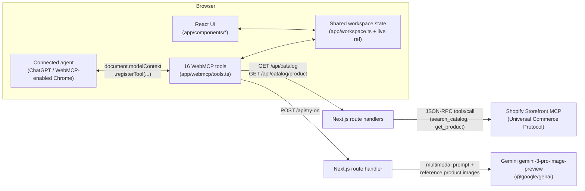

# Make This Look Mine

A co-shopping demo built for the [OpenAI WebMCP Challenge](https://openai.com/webmcp-challenge/). The shopper and a connected AI stylist act on **one visible outfit workspace**: every selection, rejection, lock, budget, occasion, and fitting-appointment update is live shared state — the agent never works from a hidden copy of the page.

## Run locally

```bash
npm install
npm run dev
```

Open `http://localhost:3000`. The app is a complete shopping workspace in any browser. A WebMCP-enabled browser — ChatGPT's in-app browser, or Google Chrome 149+ with `chrome://flags/#enable-webmcp-testing` — is required for a connected agent to discover and call the tools.

### Environment variables

Copy `.env.example` to `.env.local`:

| Variable                                                             | Required           | Purpose                                                                                                             |
| -------------------------------------------------------------------- | ------------------ | ------------------------------------------------------------------------------------------------------------------- |
| `GEMINI_API_KEY`                                                     | For virtual try-on | Google AI Studio key used server-side by `/api/try-on`.                                                             |
| `NEXT_PUBLIC_CHATGPT_URL`                                            | No                 | Absolute `https://` URL for the "Open in ChatGPT" launch button.                                                    |
| `BASIC_AUTH_ENABLED` / `BASIC_AUTH_USERNAME` / `BASIC_AUTH_PASSWORD` | No                 | Optional HTTP Basic Auth in front of the deployed site (`middleware.ts`). Disabled unless explicitly set to `true`. |

## Architecture

Three integrations sit on top of one shared React workspace state, kept in a single ref so WebMCP tool handlers and the UI always read and write the same live object (never a stale render closure).



**1. Product data — Shopify Storefront MCP (this app as an MCP _client_)**
`app/shopify/storefront-mcp.ts` calls Shopify's Universal Commerce Protocol MCP endpoint with JSON-RPC `tools/call` requests (`search_catalog`, `get_product`), scoped to the _Apparel & Accessories_ taxonomy and mapped to canvas slots (top / bottom / shoes / accessory) by taxonomy category ID. Responses are sanitized (string cleaning, HTTPS + allow-listed `cdn.shopify.com` image hosts, price/scene-tag normalization) and briefly cached in memory. `app/api/catalog/route.ts` and `app/api/catalog/product/route.ts` expose this as plain JSON (`GET /api/catalog?slot=...`, `GET /api/catalog/product?slot=...&id=...`) — the same endpoints the page's catalog loader and the `get_category_products` / `get_product_details` WebMCP tools both call — the tool names and descriptions stay backend-agnostic even though Shopify is the current source.

**2. Virtual try-on — Gemini image generation**
`app/api/try-on/route.ts` takes the selected outfit's product data (name, color, material, fit, and up to four Shopify image URLs) and the current occasion/budget, fetches the reference images server-side, and sends a text + image multimodal prompt to Gemini (`gemini-3-pro-image-preview` via `@google/genai`) requesting an image response. No shopper photo is ever uploaded — the model image is generated purely from product data — and the resulting `data:` URL is rendered directly in the try-on panel and the full-size look modal.

**3. WebMCP — this app as an MCP _tool provider_ for the browser**
`app/webmcp/tools.ts` defines all 16 tools, each with a real JSON Schema `inputSchema` (not just a prose description), bound to a set of live-workspace adapters. `app/page.tsx` registers them once per mount via `document.modelContext.registerTool(...)` and keeps a `live` ref mirroring the same React state the UI renders from, so a connected agent and the human shopper are editing one shared, visible workspace rather than two copies that can drift apart.

### Project structure

| Path                            | Responsibility                                                                                                          |
| ------------------------------- | ----------------------------------------------------------------------------------------------------------------------- |
| `app/workspace.ts`              | Shared workspace types, default state, slots/stores/dates, `money`/`log` helpers.                                       |
| `app/components/*`              | UI: navigation, hero, stylist panel, candidate studio, canvas, try-on, appointment, activity/tools drawers, look modal. |
| `app/webmcp/tools.ts`           | Complete WebMCP tool definitions (schemas + handlers) and the registration function.                                    |
| `app/webmcp/tool-definition.ts` | Small factory producing the exact object `document.modelContext.registerTool` and the tools drawer both consume.        |
| `app/shopify/storefront-mcp.ts` | Shopify Storefront (UCP) MCP client — catalog search and product detail.                                                |
| `app/api/*`                     | Next.js route handlers: Shopify catalog proxy and Gemini try-on.                                                        |
| `app/page.tsx`                  | State ownership, catalog loading, WebMCP registration lifecycle, and component composition.                             |

## WebMCP tools

On mount, the app feature-detects `document.modelContext.registerTool` and registers the following. Outside a supported browser it shows a non-blocking readiness message and still loads normally.

| Tool                      | Inputs                                       | Effect                                                                                            |
| ------------------------- | -------------------------------------------- | ------------------------------------------------------------------------------------------------- |
| `get_outfit_state`        | —                                            | Reads the live workspace: items, provenance, locks, constraints, last shopper action, revision.   |
| `get_visible_candidates`  | —                                            | Reads the candidates currently visible for the active slot.                                       |
| `get_category_products`   | `slot`                                       | Reads every live product available for a canvas slot.                                             |
| `get_product_details`     | `slot`, `productId`                          | Reads normalized product detail (description, options, variants).                                 |
| `set_outfit_candidates`   | `slot`, `productIds`, `rationale`            | Replaces the visible candidates for a slot.                                                       |
| `replace_outfit_item`     | `slot`, `productId`, `reason`                | Places or replaces an item in a slot; refuses a locked one.                                       |
| `lock_outfit_item`        | `slot`                                       | Locks the current item in a slot as human-approved.                                               |
| `set_outfit_constraint`   | `type`, `value`                              | Changes budget, occasion, color, formality, or fit.                                               |
| `explain_current_outfit`  | `explanation`                                | Updates the visible stylist reasoning.                                                            |
| `get_appointment_state`   | —                                            | Reads the fitting-appointment state, mock stores, and next-seven-day availability.                |
| `set_appointment_store`   | `storeId`                                    | Chooses a mock fitting store; opens the appointment panel.                                        |
| `set_appointment_slot`    | `date`, `time`                               | Chooses an available fitting date/time; opens the appointment panel.                              |
| `set_appointment_contact` | `name`, `surname`, `phone`, `email`, `note?` | Sets fitting contact details; opens the appointment panel.                                        |
| `confirm_appointment`     | —                                            | Confirms the appointment once store, slot, and contact are complete; opens the appointment panel. |
| `cancel_appointment`      | —                                            | Clears the confirmation on the current appointment; opens the appointment panel.                  |
| `generate_virtual_try_on` | —                                            | Generates and displays a Gemini virtual try-on from the live canvas selection.                    |

All mutating tools validate unknown products, duplicate candidate IDs, incompatible slots, bad constraints, and locked-item conflicts, and every appointment-writing tool reveals the appointment panel itself (mirroring how try-on generation reveals its own panel) so a connected agent's actions are always visible, not silent. Successful mutations increment the shared revision and appear in the WebMCP activity drawer.

There is intentionally no fake "stylist respond" control. In a supported environment, let the agent call the registered tools; the activity drawer is evidence of the human → agent → page loop.

## Shared state design

The React page keeps one central workspace model. The UI reads from it, and every WebMCP handler reads/mutates that same live model via a ref — agent context is never a hidden copy. Shopper actions mark provenance as `YOUR CHOICE`, agent calls render as `AI PICK`, and locks render as `LOCKED BY YOU`.

## Using it with ChatGPT's desktop app

### Connect

1. Install the [ChatGPT desktop app](https://openai.com/chatgpt/download/) — its built-in in-app browser supports WebMCP out of the box, no flags required. (Google Chrome 149+ with `chrome://flags/#enable-webmcp-testing` also works.)
2. Open this app's URL in that browser. If `NEXT_PUBLIC_CHATGPT_URL` is configured, the **ChatGPT ↗** button does this for you — it opens a ChatGPT conversation with a `/browser open <this app's URL>` prompt pre-filled.
3. Confirm the connection: the hero status dot switches to _"WebMCP connected — live workspace available"_, and the **WebMCP tools** drawer lists all 16 registered tools.
4. From then on, just talk to ChatGPT — it reads and writes the same workspace you're looking at, and every tool call it makes shows up immediately in the UI and in the **WebMCP activity** drawer, not behind the scenes.

### Example conversations

**Building a first look**

> **You:** Put together an everyday outfit for me under €200, then explain why you picked it.
>
> **ChatGPT:** _(calls `get_outfit_state`, `get_category_products` for each slot, `replace_outfit_item` for top/bottom/shoes, `explain_current_outfit`)_ I've put together a cream linen top, olive trousers, and white sneakers — €178 total, comfortably under your €200 budget for an easy everyday look. Want an accessory too?

**Respecting a lock**

> **You:** I'm keeping the trousers. Make the rest of the outfit more office-appropriate.
>
> **ChatGPT:** _(calls `get_outfit_state` — sees the trousers are locked — then `set_outfit_constraint` for occasion → Office, `replace_outfit_item` on the unlocked slots only, and `explain_current_outfit`)_ Kept your trousers since they're locked, swapped in a tailored shirt and loafers for the office, and updated the reasoning panel so you can see why.

**Try-on and booking a fitting**

> **You:** Show me a try-on of this outfit, then book a fitting at your Amsterdam store this Friday at 11:30 — I'm Ada Lovelace, ada@example.com.
>
> **ChatGPT:** _(calls `generate_virtual_try_on`, then `get_appointment_state`, `set_appointment_store`, `set_appointment_slot`, `set_appointment_contact`, `confirm_appointment`)_ Here's your look on the model. I've also reserved Friday 11:30 at De Bijenkorf Studio in Amsterdam under Ada Lovelace — you'll see it confirmed in the appointment panel.

In every case, nothing ChatGPT does is hidden: the same revision counter, provenance badges, and activity log you'd see from clicking through the UI yourself update in real time as the tools run.

## Try it

1. Click **Demo reset**: €500, Everyday, empty canvas.
2. Ask the connected agent to read the live candidates for the top slot (`get_category_products`) and add one to the canvas.
3. Lock that item with **Keep this**, then switch the occasion to **Office**.
4. Ask the agent to re-read state (`get_outfit_state`) and complete the rest of the outfit within budget, calling `explain_current_outfit` to explain its reasoning.
5. Ask the agent to generate a virtual try-on, then reserve an in-store fitting — watch the appointment panel open on its own as the agent books it.
6. Open **WebMCP activity** to see the exact read/write tool sequence.

## Notes

The product catalog is live data from a Shopify store via the Storefront (UCP) MCP endpoint — there is no local product database, authentication, inventory, or payment flow. `GEMINI_API_KEY` is required only for the virtual try-on feature; the rest of the app works without it.

## License

MIT — see [LICENSE](LICENSE).
